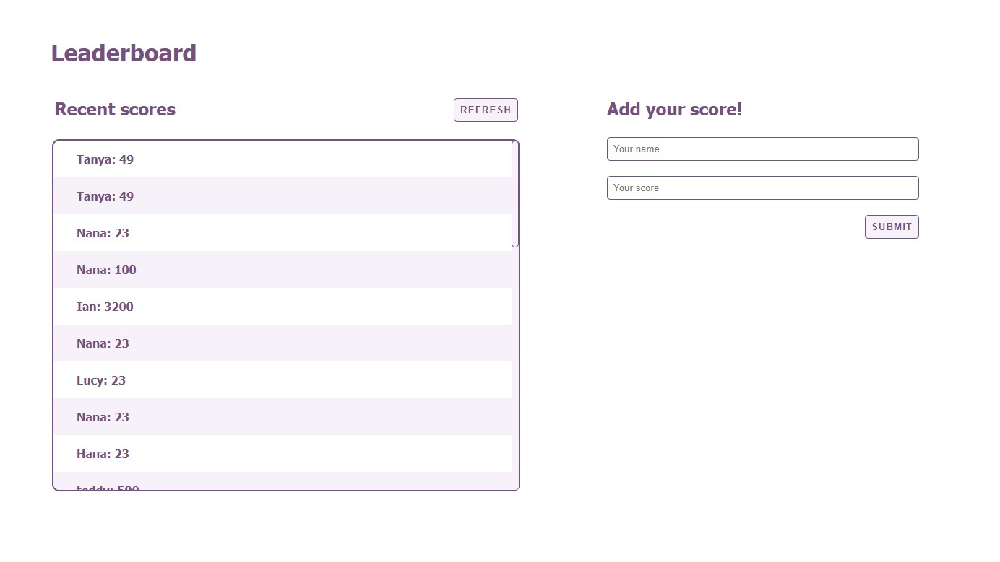

# Leaderboard

> This project is a Leaderboard where you can pass your scores. The main goal of this project is to practice using an API.

## Built With

- HTML, CSS, JavaScript
- SCSS

## Live Demo

[Click here to see a live version of this app!](https://affectionate-kilby-a992c3.netlify.app/)

## Getting Started

To get a local copy up and running follow these steps:

1. Clone the project to your local machine.
2. Open the folder with your favourite IDE.
3. Enter `npm i`
4. Enter `npm start`

## Author

- GitHub: [@rdnrn](https://github.com/rdnrn)
- LinkedIn: [Nana Rodina](https://www.linkedin.com/in/arina-rodina-144612219/?locale=en_US)
- Twitter: [nana](https://twitter.com/rdnrn_nana)

## 🤝 Contributing

Contributions, issues, and feature requests are welcome!

## Show your support

Give a ⭐️ if you like this project!